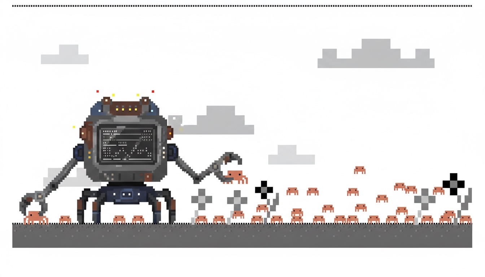

# Claudicle

[](https://github.com/telepenin/claudicle/actions/workflows/ci.yml)
[](https://codecov.io/gh/telepenin/claudicle)

<p align="center">
  
</p>

The chronicles of Claude. Open-source tool to collect and visualize [Claude Code](https://claude.ai/code) session telemetry. Run a Docker Compose stack, point Claude Code's built-in OpenTelemetry export at it, and browse your sessions in a web UI.

## Features

- **Telemetry collection** — captures Claude Code OTel events via OTLP: API costs, token usage, tool calls, model usage, errors, and more
- **Session log collection** — tails `~/.claude/projects/*.jsonl` to ingest full conversation transcripts including Claude's responses, thinking blocks, and tool outputs
- **Dashboard** — cost and token trends, top models and tools (with min/avg/max duration and success rate), events by type, filterable by project/environment/team/developer
- **Session browser** — searchable list with message counts, subagent and error indicators, date range filtering, pagination
- **Session detail view** — rendered conversation with rich tool visualizations (Write/Edit diffs, Read with line numbers, Bash output, Grep results, WebSearch/Fetch, MCP tools, nested subagent sessions), live tail for active sessions, raw JSONL toggle
- **Session export** — portable `.tar.gz` archive preserving the `~/.claude/projects/` structure, one-liner to restore and resume on any machine

## Architecture

```
                   ┌──OTLP HTTP──▶  OTel Collector (:4318) ──────────────────────────────┐
Claude Code ───────┤                                                                       ├──▶  ClickHouse  ──▶  Next.js App (:3000)
                   └──JSONL──▶  ~/.claude/projects/*.jsonl  ──▶  OTel Collector (filelog) ┘
```

- **OTel Collector** (local install, otelcol-contrib) — receives OTLP on port 4318 + tails JSONL files, exports both to ClickHouse
- **ClickHouse** (Docker) — stores OTel events and full session logs
- **Next.js App** (Docker) — web UI and API routes that query ClickHouse

## Quick Start

### 1. Start the stack

```bash
git clone https://github.com/telepenin/claudicle
cd claudicle
cp .env.example .env   # edit credentials if needed
docker compose up -d
```

### 2. Configure Claude Code

Add the following to your `~/.claude/settings.json` to enable telemetry and set your dashboard dimensions:

```json
{
  "env": {
    "CLAUDE_CODE_ENABLE_TELEMETRY": "1",
    "OTEL_LOGS_EXPORTER": "otlp",
    "OTEL_METRICS_EXPORTER": "otlp",
    "OTEL_EXPORTER_OTLP_PROTOCOL": "http/protobuf",
    "OTEL_EXPORTER_OTLP_ENDPOINT": "http://localhost:4318",
    "OTEL_LOG_USER_PROMPTS": "1",
    "OTEL_LOG_TOOL_DETAILS": "1",
    "OTEL_RESOURCE_ATTRIBUTES": "project=my-project,developer=nikolay"
  }
}
```

The `OTEL_RESOURCE_ATTRIBUTES` value is a comma-separated list of `key=value` pairs used as filter dimensions in the dashboard:

| Key | Description | Example |
|-----|-------------|---------|
| `project` | Project name | `claudicle` |
| `environment` | Environment | `dev`, `ci` |
| `team` | Team name | `platform`, `frontend` |
| `developer` | Developer name | `nikolay` |

Once saved, just run `claude` — no wrapper script needed.

### 3. (Optional) Enable full session logs

Run the OTel Collector locally to get full conversation transcripts including Claude's responses:

```bash
./scripts/run-otelcol.sh
```

### 4. Browse sessions

Open [http://localhost:3000](http://localhost:3000).

## What Gets Collected

**OTel events:**

| Event | Data |
|-------|------|
| `claude_code.user_prompt` | prompt text/length |
| `claude_code.tool_result` | tool name, success, duration, parameters |
| `claude_code.api_request` | model, cost, input/output/cache tokens, duration |
| `claude_code.api_error` | model, error, status code |
| `claude_code.tool_decision` | tool name, accept/reject, source |

**OTel metrics:** token usage, cost, session count, lines of code, commits, pull requests, active time.

**JSONL session logs** (optional): full conversation transcripts — user prompts, Claude's text responses, thinking blocks, tool call inputs/outputs.

## Pages

| Route | Description |
|-------|-------------|
| `/` | Dashboard with cost/token charts and dimension filters |
| `/logs` | Searchable session list with message counts and breakdown |
| `/logs/[id]` | Rendered conversation with subagent support, live tail, raw JSONL toggle, and archive download |
| `GET /api/logs/[id]/archive` | Download session as `.tar.gz` (main JSONL + subagent files) |

## Tech Stack

- **Next.js 16** (App Router) — frontend and API routes
- **ClickHouse** — event, metric, and session storage
- **OTel Collector** (otelcol-contrib) — OTLP receiver + filelog receiver → ClickHouse exporter
- **Tailwind CSS** + **shadcn/ui** — UI components
- **recharts** — dashboard charts
- **@clickhouse/client** — ClickHouse queries from Node.js

## Planned

- **JSONL redaction** (optional) — pre-process JSONL session logs to strip or truncate sensitive data (file contents, bash outputs, API keys) before ingestion into ClickHouse. Approaches under consideration: file watcher script that writes sanitized copies to a mirror directory, or a custom OTel Collector processor plugin.
- **[OpenClaw](https://github.com/openclaw/openclaw) support** — collect and visualize telemetry from OpenClaw AI assistant sessions alongside Claude Code data.

## Verify the Pipeline

```bash
curl "http://localhost:8123/?user=${CLICKHOUSE_USER}&password=${CLICKHOUSE_PASSWORD}&database=claude_logs" \
  --data-binary 'SELECT count() FROM otel_logs'
```

## License

MIT
