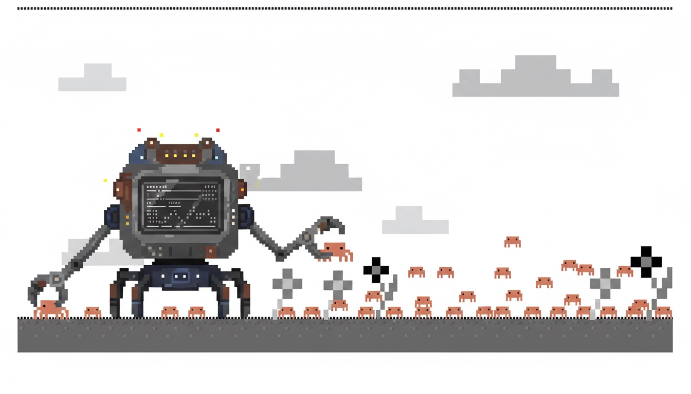

# Claudicle

[](https://github.com/telepenin/claudicle/actions/workflows/ci.yml)
[](https://codecov.io/gh/telepenin/claudicle)
[](LICENSE)

<p align="center">
  
</p>

**The chronicles of Claude.** Collect and visualize your [Claude Code](https://claude.ai/code) session telemetry — costs, tokens, tool usage, and full conversation transcripts — in a self-hosted web UI.

## Why Claudicle?

Claude Code doesn't show you where your money goes. Claudicle gives you a dashboard for API costs, token trends, and tool performance across sessions. It also captures full conversation transcripts so you can review, search, and export any session — whether you're tracking your own usage or monitoring a team.

<!-- [Live Demo](https://demo.claudicle.dev) | -->
[Installation Guide](docs/installation.md) | [Configuration](docs/configuration.md) | [Contributing](CONTRIBUTING.md)

## Quick Start

```bash
git clone https://github.com/telepenin/claudicle && cd claudicle
cp .env.example .env
docker compose up -d
```

Add to `~/.claude/settings.json`:

```json
{
  "env": {
    "CLAUDE_CODE_ENABLE_TELEMETRY": "1",
    "OTEL_LOGS_EXPORTER": "otlp",
    "OTEL_METRICS_EXPORTER": "otlp",
    "OTEL_EXPORTER_OTLP_PROTOCOL": "http/protobuf",
    "OTEL_EXPORTER_OTLP_ENDPOINT": "http://localhost:4318",
    "OTEL_RESOURCE_ATTRIBUTES": "project=my-project,developer=your-name"
  }
}
```

Open [http://localhost:3000](http://localhost:3000). For full setup details, see the [Installation Guide](docs/installation.md).

## Features

- **Dashboard** — cost and token trends, top models and tools, events by type, filterable by project/environment/team/developer
<!--  -->
- **Session browser** — searchable list with message counts, subagent and error indicators, date range filtering
<!--  -->
- **Session detail view** — rendered conversations with rich tool visualizations (diffs, code blocks, search results, MCP tools, nested subagent sessions), live tail for active sessions
<!--  -->
- **Session export** — portable `.tar.gz` archives preserving the `~/.claude/projects/` structure, restore and resume on any machine

## Architecture

```
                   ┌──OTLP HTTP──▶  OTel Collector (:4318) ──────────────────────────────┐
Claude Code ───────┤                                                                       ├──▶  ClickHouse  ──▶  Next.js App (:3000)
                   └──JSONL──▶  ~/.claude/projects/*.jsonl  ──▶  OTel Collector (filelog) ┘
```

- **OTel Collector** (otelcol-contrib) — receives OTLP on port 4318 + tails JSONL files, exports to ClickHouse
- **ClickHouse** (Docker) — stores events, metrics, and session logs
- **Next.js App** (Docker) — web UI and API routes

## What Gets Collected

| Source | Data |
|--------|------|
| OTel events | user prompts, tool results (name/duration/success), API requests (model/cost/tokens), errors, tool decisions |
| OTel metrics | token usage, cost, session count, lines of code, commits, PRs, active time |
| JSONL logs (optional) | full conversation transcripts — prompts, responses, thinking blocks, tool I/O |

Run the OTel Collector locally (`./scripts/run-otelcol.sh`) to enable JSONL log collection. See the [Installation Guide](docs/installation.md#5-optional-start-the-otel-collector).

## Roadmap

- Session analysis reports — per-session health dashboards with error timelines, tool success rates, and actionable insights
- Cross-session A/B testing — compare metrics across skill versions, CLAUDE.md configs, and MCP setups
- Self-improving skills — analyze session history to auto-improve Claude Code skills (superpowers): detect failure patterns (over-tasked subagents, skill-triggered errors, MCP misfires), generate targeted SKILL.md edits, and A/B test skill versions across sessions to measure impact
- JSONL redaction — strip sensitive data before ingestion
- [OpenClaw](https://github.com/openclaw/openclaw) support

## Tech Stack

Next.js 16 (App Router) · ClickHouse · OTel Collector · Tailwind CSS · shadcn/ui · recharts

## Contributing

Contributions welcome! See [CONTRIBUTING.md](CONTRIBUTING.md) for development setup and guidelines.

## License

[MIT](LICENSE)
